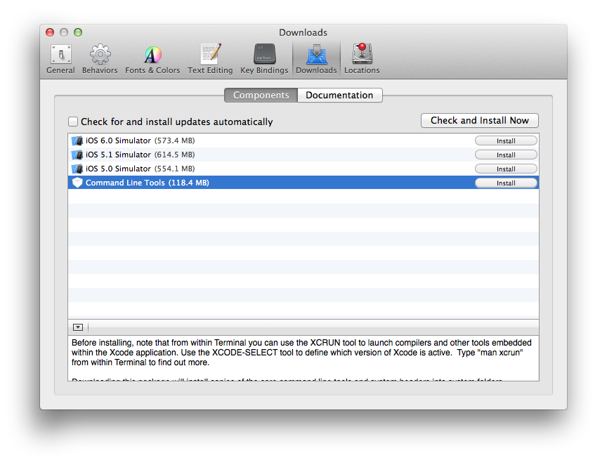

Installation
============

Dans cette première section, nous allons installer Ruby.

Cette partie du tutoriel concerne (pour l'instant) uniquement Linux et Mac OS.

Une première chose à savoir est que de nombreuses versions de Ruby existent, la plus récente étant Ruby 2.0.

Sur Linux, il est possible d'obtenir Ruby par les différents gestionnaires de paquets (apt, yum, etc), cependant, la version installée sera Ruby 1.8.7

Sur Mac OS, Ruby est installé par défaut, encore, en version 1.8.7.

Il existe un outil baptisé **[RVM](http://rvm.io)** (*Ruby Version Manager*), qui permet d'installer et d'utiliser plusieurs versions de Ruby sur son système. Nous allons l'utiliser dans ce tutoriel.

Sachez qu'il existe d'autres outils ayant le même but, par exemple [rbenv](https://github.com/sstephenson/rbenv), libre à vous d'utiliser celui que vous voulez, mais le tutoriel ne présentera que RVM.

## Préambule pour Mac OS

Si vous utilisez linux, vous pouvez passer cette partie.

### Xcode et les "Command line tools"

Afin de pouvoir installer rvm et l'utiliser correctement, vous aurez besoin d'installer Xcode et les outils qui vont avec.

Xcode s'installe facilement depuis l'App Store.

Ouvrez les préférences de XCode, et sélectionnez l'onglet Downloads.

Installez les "Command line tools"

### Homebrew

Certaines librairies ruby que vous allez utiliser utilisent des librairies système, des dépendences. Sur Mac OS, Il n'éxiste pas de moyen officiel de gérer les paquets, comme sur Linux par exemple. Heureusement, il existe **homebrew**

Pour installer homebrew, rien de mieux que de suivre le tutoriel officiel, [en Français s'il vous plait !](http://mxcl.github.com/homebrew/index_fr-fr.html)

## Préambule pour linux

Vous devez avoir un compilateur C / C++ d'installé sur votre machine afin de pouvoir compiler Ruby.

Ruby supporte Clang et GCC.

Si vous ne savez pas lequel choisir, installez le compilateur conseillé par votre distribution :

Avec apt-get (Debian, Ubuntu et autres dérivés)

    apt-get install build-essential

Avec yum (Fedora, RedHat, CentOs, etc)

    yum groupinstall “Development Tools”

# Installons RVM

Nous pouvons maintenant passer à l'installation de RVM à proprement parler.

Ouvrez votre terminal par défaut et tapez cette commande magique :

    curl -L https://get.rvm.io | bash -s stable --autolibs=enabled

Cette commande va récupérer l'installeur depuis le site de rvm et l'éxécuter, et vous installera la version stable actuelle de Ruby (*2.0.0* à l'heure actuelle)

## Problèmes connus à l'installation

[A remplir]

## Utilisons rvm

Première chose à faire, charger rvm pour chaque session shell.

Ajoutez ce bout de script dans votre fichier de configuration de shell ( ``~/.bashrc`` par exemple)

    [[ -s "$HOME/.rvm/scripts/rvm" ]] && . "$HOME/.rvm/scripts/rvm"

Réouvrez votre shell ou rechargez vos préférences ( ``source ~/.bashrc`` par exemple)

Vous pouvez maintenant utiliser rvm !

Passons en revue les commandes rvm de base.

### Lister les versions de ruby installées :

Lancez la commande ``rvm list``

Sur ma machine, voila ce que ca donne :

    rvm rubies

       rbx-head [ x86_64 ]
       ruby-1.9.3-p194 [ x86_64 ]
       ruby-1.9.3-p327-turbo [ x86_64 ]
    =* ruby-2.0.0-p0 [ x86_64 ]

    # => - current
    # =* - current && default
    #  * - default

Vous devriez avoir Ruby 2.0.0 d'installé, si ce n'est pas le cas, lancez ``rvm install 2.0.0``

### Utiliser une version de ruby particulière

``rvm use 2.0.0``

Pour utiliser une version par défaut :

``rvm use 2.0.0 --default``

Pour tester, lancez ``ruby -v``
